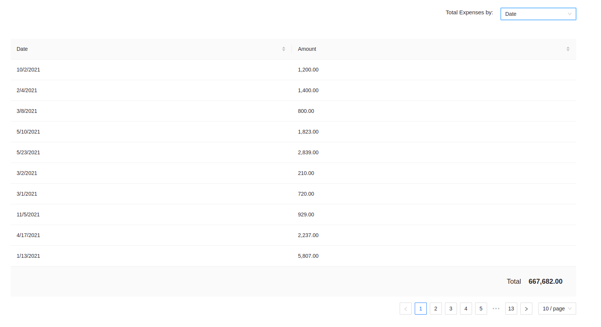

# expenses-poc
This is a simple UI application to display/present expenses in different groups and order

## Table of contents
* [ScreenShots](#screenshots)
* [Technologies](#technologies)
* [Setup locally](#setup-locally)
* [Demo](#live-version-demo)

## Screenshots





## Technologies
Project is created with:
* React
* TypeScript
* Styled Components
* Ant Design


## Setup locally
To run this project, simply follow the instructions below and run the commands as in same order. 
```
$ git clone git@github.com:nwashangai/expenses-poc.git
$ cd expenses-poc
$ npm install or yarn install
$ npm start
```

To run test
```
$ npm run test or yarn test
$ npm run test --coverage or yarn test --coverage
```

## Live version Demo
[Expenses POC](https://codesandbox.io/s/wild-glade-1mcfke)


> I have used Ant design to speed up with the task and also because of it's flexibilty with styled component
> 
> I have written unit test for most components created with exception of those making reference to the fetch API because of my defficulty in mocking fetch api in the recent version of react with typescript
